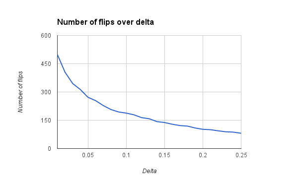

Point estimation bounds
=======================

Hoeffding's inequality gives us a theoretical lower bound on the number of flips needed to estimate the parameter of a biased coin. If you want to estimate the parameter of a biased coin, +/- epsilon with 1-delta probability, the minimum number of flips, N, is N >= ln(2/delta) / (2*epsilon^2). For example, if we would like to be 95% sure we've estimated the parameter of a biased coin, +/- 0.1, then N >= 184.4.

However, this is a loose bound. The actual number of flips needed may be smaller. This experiment simulates coin flipping and gives you the actual numbers. In our example above (epsilon = 0.1, delta = 0.05), it turns out the actual number of flips needed is around 69.

This chart shows that delta, our uncertainty about whether we've estimated the parameter correctly, decreases exponentially with more flips, for a fixed value of epsilon (0.1 in this case). This doesn't invalidate Hoeffding's inequality, which can be rewritten as delta >= 2/exp(2*N*epsilon^2).

Writing the inequality as N >= ln(2/delta) / (2*epsilon^2) shows that the number of flips needed is more sensitive to epsilon than to delta. This is also not invalidated by the next two charts.

The first chart shows the number of flips needed for different values of epsilon, given a fixed value of delta=0.05.

The second chart shows the number of flips needed for different values of delta, given a fixed value of epsilon=0.05.

